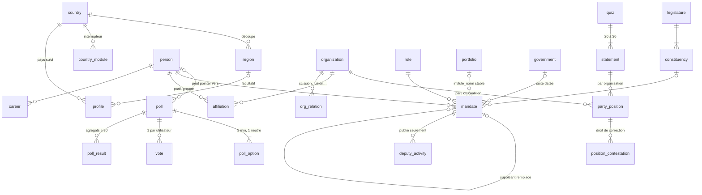

# Schéma Palabre — décisions de modélisation

Étape 1 du plan de construction. Huit migrations dans `supabase/migrations/`,
un jeu de test dans `supabase/seed.sql`, onze blocs d'assertions dans
`supabase/tests/schema_test.sql`.

## Vue d'ensemble

## Pays

- `country.code` est le code ISO alpha-2. `fuseau` (IANA) sert à calculer
  les créneaux de sondage ; tout est stocké en UTC.
- `region` est une table, jamais un texte libre : c'est la clé des découpes.
- `country_module` est l'interrupteur de la section 13. Suspendre `poll` ou
  `quiz` pour un pays en période électorale se fait par une ligne, sans
  mise à jour de l'app. Le client lit la table au démarrage.
- `app_config` porte le domaine de secours et la version minimale.
- `profile` : pays obligatoire, tranche d'âge et région facultatives. La clé
  composite `(region_id, country_code)` garantit qu'une région appartient au
  pays du profil. Pas de distinction diaspora.

## Sondage

- L'état d'un sondage (`brouillon`, `programme`, `ouvert`, `ferme`) est
  **déduit des horodatages** par `poll_statut()`, jamais écrit par un cron.
  Aucun décalage possible à l'ouverture ou à la fermeture.
- `ouverture` et `fermeture` sont remplis par trigger à l'insertion :
  lundi 08:00 et dimanche 20:00 dans le fuseau du pays. `semaine` doit être
  un lundi.
- Trois options minimum dont une neutre, vérifié au passage de `publie` à
  vrai. Un brouillon peut être incomplet, un sondage publié non.
- `vote` : clé primaire `(poll_id, user_id)`, règles `do instead nothing`
  sur update et delete. Pas de clé étrangère vers `auth.users` : un compte
  supprimé laisse un vote orphelin et anonyme, ce qui préserve les agrégats.
- Le trigger `vote_avant_insert` impose `user_id = auth.uid()` et
  `cree = now()` quand l'appel vient de l'API, vérifie la fenêtre et
  l'appartenance de l'option, et **fige un instantané du profil** (pays,
  tranche d'âge, région). Un profil modifié après coup ne réécrit pas les
  découpes.
- `poll_result` ne contient que des agrégats : dimension `total` toujours
  présente, dimensions `pays`, `tranche_age`, `region` seulement pour les
  cellules d'au moins `seuil_decoupe()` (30) répondants. Chaque cellule
  liste toutes les options, y compris à zéro. Le pourcentage se calcule
  côté client : `n / n_cellule`.
- Vote avant résultats : la politique RLS de `poll_result` n'ouvre la
  lecture que si le sondage est fermé ou si l'utilisateur y a voté.
- `poll_public` est la seule vue lue par l'app : question, contexte,
  sources, options, état, nombre de répondants. Jamais de score.
- `poll_anomalie` (équipe uniquement) signale la part de votes venant de
  comptes créés moins d'une heure avant, le pic par minute et les votes sans
  profil. Elle ne bloque rien : l'équipe pose `poll.suspect` et son motif,
  affichés publiquement.
- Un seul cron, `palabre_poll_tick`, toutes les cinq minutes : recalcule
  les sondages ouverts et fige ceux qui viennent de fermer
  (`resultat_final_le`). Sur un Postgres sans `pg_cron`, la migration se
  contente d'un avertissement.

## Testez-vous

- Schéma de la section 5 repris tel quel, avec deux contraintes en plus :
  `source_type = 'aucune'` si et seulement si `position = 'sans_position'`
  (aucune extrapolation), et `document_public` exige lien et extrait.
  L'extrait est plafonné à 600 caractères : citation courte, jamais le
  texte intégral.
- Un quiz publié compte entre 20 et 30 affirmations et chaque organisation
  référencée a une ligne pour chaque affirmation, quitte à être
  `sans_position`. Un trou n'est pas une position.
- **Aucune table ne porte de `user_id`** dans ce module. Le résultat est
  calculé côté client. Un test l'affirme.
- `position_contestation` : dépôt ouvert à tous, lecture réservée à
  l'équipe. Le champ `auteur` est un contact déclaré, jamais un identifiant
  de compte.

## Base factuelle

- Un gouvernement est une suite de mandats datés. `gouvernement_a(pays,
  date)` recompose la grille à n'importe quelle date, c'est l'écran
  signature. Une contrainte d'exclusion interdit deux gouvernements
  simultanés dans un pays.
- `portfolio.intitule_norm` suit un portefeuille à travers ses renommages.
  Le jeu de test le montre : « Santé et Action sociale » devient « Santé,
  Hygiène publique et Action sociale » avec la même clé `sante`.
- `government.portefeuilles_total` et `gouvernement_couverture()` donnent
  « 5 des 25 portefeuilles renseignés ». Une absence assumée vaut mieux
  qu'une donnée inventée.
- `mandate.confiance` encode le niveau de la source dans l'ordre d'autorité
  de la section 6 : `journal_officiel`, `communique`, `agence`, `wikidata`,
  `presse`. Une fin de mandat a toujours un motif.
- `affiliation` est séparée de `mandate` : un député peut changer de groupe
  en cours de mandat. `assemblee_a(pays, date)` prend l'affiliation en
  vigueur à la date demandée.
- Pas de photo sans `photo_source`. Le client gère le repli en initiales.

## Assemblée

- `mandate.qualite` (`titulaire` ou `suppleant`) et `remplace_mandate_id`
  modélisent la suppléance. Un titulaire nommé ministre clôt son mandat avec
  `nomination_gouvernement` et son suppléant ouvre le sien en pointant sur
  lui. Un suppléant sans mandat remplacé est refusé.
- `deputy_activity` ne contient que ce qui est publié : chaque colonne est
  nulle quand l'assemblée ne publie pas la donnée, et le client affiche
  « non publié », jamais zéro. Aucun score, aucun classement.
- `legislature.scrutins_nominatifs` est à faux : le client affiche le
  bandeau « scrutins nominatifs indisponibles ». Aucune table de scrutins.

## RLS

| Table | anon / authenticated | Écriture |
|---|---|---|
| country, region, country_module, app_config | lecture | service |
| profile | le sien | le sien (insert, update) |
| base factuelle, assemblée | lecture | service |
| poll, poll_option | publiés | service |
| vote | les siens | insert, soi-même, sondage ouvert |
| poll_result | fermé ou déjà voté | service (cron) |
| quiz, statement, party_position | quiz publié | service |
| position_contestation | rien | insert par tous |
| poll_anomalie | interdit | service |

Les utilisateurs anonymes Supabase portent le rôle `authenticated`, donc
toutes les politiques utilisateur leur sont ouvertes. Les fonctions
`poll_tick`, `calculer_resultats`, `poll_valider` et `quiz_valider` ne sont
pas exécutables par l'API.

## Jeu de test

Tout est fictif et préfixé « Test ». Il exerce : 300 profils à répartition
inégale (Dakar 40 %, Thiès 15 %) pour que certaines cellules passent le
seuil de 30 et d'autres non ; deux sondages fermés, un ouvert, un programmé ;
deux gouvernements avec un renommage, une démission et un portefeuille non
pourvu ; une législature avec une suppléance et un changement de groupe ;
un quiz de 5 affirmations avec les trois niveaux de source, volontairement
non publiable.

## Ce qui reste hors de ce schéma

- Pas de table de réponses au quiz, pas de scrutins nominatifs, pas de
  commentaires, pas de comptes publics.
- Les notifications (étape 4) s'appuieront sur `poll.ouverture` et un cron
  du lundi, sans nouvelle table côté vote.

## Migration 0009 : API et notifications

- `voter(poll_id, option_id)` : un appel, et les résultats en retour. Le
  client n'insère jamais dans `vote` directement.
- `poll_resultats(poll_id)` renvoie le JSON lu par l'app, sous les mêmes
  règles que la politique RLS : sondage fermé, ou l'appelant y a voté.
- `device_token` : jetons FCM avec pays et langue, chacun ne lisant que les
  siens. `notification_destinataires(type)` calcule côté base qui reçoit
  quoi : tous les jetons du pays à l'ouverture, seuls ceux qui n'ont pas
  voté pour le rappel du samedi 10h locale.
- Cron horaire `palabre_poll_notify` → `pg_net` → Edge Function
  `poll-notify`, si `pg_cron`, `pg_net` et deux secrets Vault sont présents.
